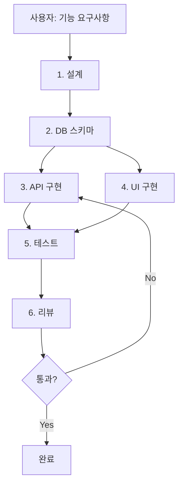
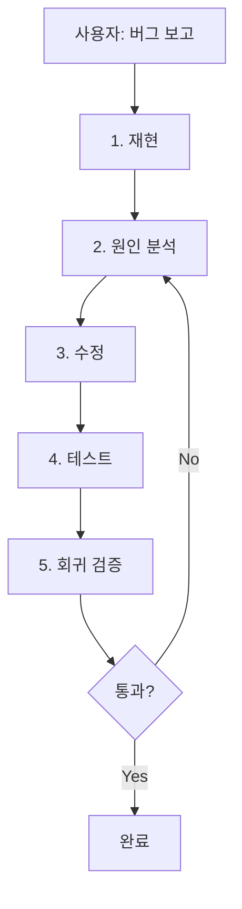
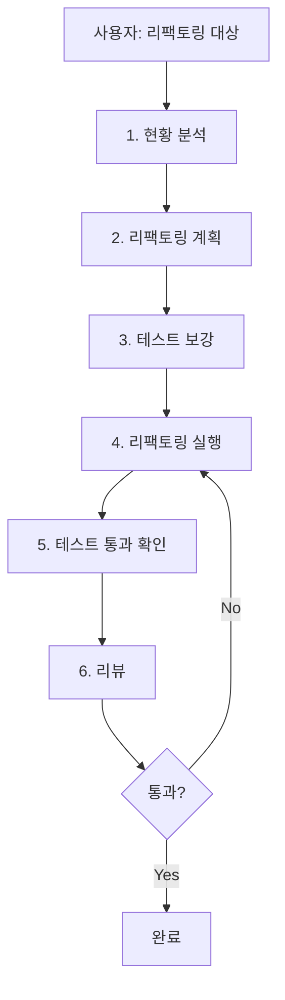

# 오케스트레이터 — 멀티 에이전트 파이프라인

> 복잡한 작업을 여러 에이전트가 순차/병렬로 처리하는 오케스트레이터 3종.  
> 단일 에이전트로 부족한 **대규모 기능 개발, 버그 수정, 리팩토링**에 사용합니다.

---

## 오케스트레이터란?

오케스트레이터는 **여러 전문 에이전트를 지휘하는 상위 에이전트**입니다.

```
사용자 → 오케스트레이터 → 에이전트 A (설계)
                        → 에이전트 B (구현)   ← 병렬
                        → 에이전트 C (테스트)
                        → 에이전트 D (리뷰)
```

### 언제 오케스트레이터를 쓰는가

| 상황 | 단일 에이전트 | 오케스트레이터 |
|------|------------|-------------|
| 파일 1~2개 수정 | ✅ | ❌ 과잉 |
| API + UI + DB 동시 변경 | ❌ 컨텍스트 부족 | ✅ |
| 리뷰 + 보안 + 성능 병렬 검토 | ❌ 순차만 가능 | ✅ |
| 단순 버그 수정 | ✅ | ❌ 과잉 |
| 여러 계층에 걸친 기능 구현 | ⚠️ 가능하나 품질↓ | ✅ |

> **주의**: 오케스트레이터는 토큰 소모가 단일 세션의 **3~5배**입니다. 작은 작업에는 사용하지 마세요.

---

## 설치

```bash
mkdir -p .claude/agents

# 오케스트레이터 + 의존 에이전트를 모두 설치해야 합니다
# 아래 각 오케스트레이터 섹션의 "필요 에이전트"를 확인하세요
```

---

## 오케스트레이터 1: 기능 개발 (Feature Development)

### 개요

새로운 기능을 **스키마 → API → UI → 테스트 → 리뷰** 순서로 end-to-end 구현합니다.

### 파이프라인



### 필요 에이전트

| 단계 | 에이전트 | 역할 |
|------|---------|------|
| 1. 설계 | `fastapi-architect` | API 스펙 + 계층 구조 설계 |
| 2. DB | `sqlalchemy-dev` + `alembic-migration` | 모델 + 마이그레이션 |
| 3. API | `pydantic-schema` + `fastapi-dev` | 스키마 + 라우터 + 서비스 |
| 4. UI | `htmx-pattern` + `jinja-htmx-dev` + `tailwind-ui` | 패턴 설계 + 구현 |
| 5. 테스트 | `test-engineer` | 단위 + 통합 테스트 |
| 6. 리뷰 | `code-reviewer` + `security-auditor` | 품질 + 보안 검토 |

### 오케스트레이터 파일

`.claude/agents/feature-orchestrator.md`:

```markdown
---
name: feature-orchestrator
description: FastAPI+HTMX 기능 개발 오케스트레이터 — 설계→DB→API→UI→테스트→리뷰 파이프라인
model: opus
---

# Feature Development Orchestrator

## 역할
새로운 기능을 6단계 파이프라인으로 end-to-end 구현합니다.

## 파이프라인

### 단계 1: 설계 (@fastapi-architect)
- 요구사항 분석
- API 엔드포인트 목록 (메서드/경로/입출력/인증)
- 계층 다이어그램 (Router → Service → Model)
- 파일 생성/수정 목록
- **산출물**: `planning/step-1-design.md`
- **승인 후 다음 단계로**

### 단계 2: DB 스키마 (@sqlalchemy-dev → @alembic-migration)
- SQLAlchemy 모델 작성 (`app/models/`)
- 관계 정의 (selectinload 명시)
- Alembic 마이그레이션 생성 + 실행
- **산출물**: 모델 파일 + 마이그레이션 파일
- **승인 후 다음 단계로**

### 단계 3: API 구현 (@pydantic-schema → @fastapi-dev)
- Pydantic 스키마 작성 (`app/schemas/`)
- 서비스 레이어 구현 (`app/services/`)
- 라우터 구현 (`app/routers/`)
- HTMX 요청 분기 처리
- **산출물**: 스키마 + 서비스 + 라우터 파일
- **승인 후 다음 단계로**

### 단계 4: UI 구현 (@htmx-pattern → @jinja-htmx-dev → @tailwind-ui)
- 인터랙션 패턴 설계
- 전체 페이지 템플릿 (`templates/pages/`)
- Partial fragment (`templates/components/_*.html`)
- Alpine.js 인터랙션 (필요 시)
- **산출물**: 템플릿 파일들
- **승인 후 다음 단계로**

### 단계 5: 테스트 (@test-engineer)
- API 단위 테스트 (pytest + httpx AsyncClient)
- 서비스 레이어 테스트
- 엣지 케이스 (빈값, 인증 실패, 권한 오류)
- `pytest -v` 실행하여 전체 통과 확인
- **산출물**: 테스트 파일 + 실행 결과
- **승인 후 다음 단계로**

### 단계 6: 리뷰 (@code-reviewer + @security-auditor — 병렬)
- 코드 품질 리뷰
- 보안 리뷰 (OWASP Top 10)
- 최종 판정: 머지 가능 / 조건부 / 반려
- **산출물**: 리뷰 리포트

## 제약
- 각 단계 완료 시 diff를 보여주고 사용자 승인을 기다린다
- 단계 간 산출물은 `planning/step-N-*.md`로 남긴다
- 이전 단계의 코드를 후속 단계에서 임의로 변경하지 않는다
- 리뷰에서 반려 시 해당 단계로 돌아가 수정한다
```

### 호출 프롬프트

```
@feature-orchestrator

기능: [예: "사용자 즐겨찾기 CRUD"]

요구사항:
- [AC-1: 사용자는 항목을 즐겨찾기에 추가할 수 있다]
- [AC-2: 사용자는 즐겨찾기 목록을 조회할 수 있다]
- [AC-3: 사용자는 즐겨찾기를 삭제할 수 있다]
- [AC-4: 비로그인 사용자는 401 에러]
- [AC-5: 다른 사용자의 즐겨찾기는 접근 불가]

제약:
- 기존 User 모델에 관계 추가
- API: POST/GET/DELETE /api/v1/favorites
- UI: HTMX로 즐겨찾기 토글 버튼 + 목록 페이지
- 테스트 커버리지: 80% 이상

각 단계 완료 시 승인을 기다려라.
```

---

## 오케스트레이터 2: 버그 수정 (Bug Fix)

### 개요

버그를 **재현 → 원인 분석 → 수정 → 검증 → 회귀 방지** 순서로 처리합니다.

### 파이프라인



### 필요 에이전트

| 단계 | 에이전트 | 역할 |
|------|---------|------|
| 1. 재현 | `error-debugger` | 에러 재현 및 스택트레이스 분석 |
| 2. 분석 | `codebase-analyzer` + `async-inspector` | 코드 흐름 추적 + 비동기 문제 검사 |
| 3. 수정 | `fastapi-dev` 또는 `sqlalchemy-dev` (원인에 따라) | 코드 수정 |
| 4. 테스트 | `test-engineer` | 실패 테스트 → 수정 → 통과 확인 |
| 5. 회귀 | `code-reviewer` | 수정이 다른 기능을 깨뜨리지 않는지 확인 |

### 오케스트레이터 파일

`.claude/agents/bugfix-orchestrator.md`:

```markdown
---
name: bugfix-orchestrator
description: 버그 수정 오케스트레이터 — 재현→분석→수정→테스트→회귀검증 파이프라인
model: opus
---

# Bug Fix Orchestrator

## 역할
버그를 체계적으로 추적하고 수정합니다.

## 파이프라인

### 단계 1: 재현 (@error-debugger)
- 보고된 증상으로 버그 재현
- 스택트레이스 / 에러 로그 수집
- 재현 조건 정리 (입력, 환경, 순서)
- **산출물**: `planning/bug-reproduce.md`

### 단계 2: 원인 분석 (@codebase-analyzer + @async-inspector)
- 에러 발생 경로 추적
- 관련 코드 의존 관계 분석
- 비동기 패턴 문제 검사 (해당 시)
- 근본 원인 식별 (root cause)
- **산출물**: `planning/bug-analysis.md`
- **승인 후 다음 단계로**

### 단계 3: 수정 (원인에 따라 적절한 에이전트)
- 최소 범위 수정 (관련 없는 코드 건드리지 않음)
- 수정 사유를 주석이 아닌 커밋 메시지에 기록
- **승인 후 다음 단계로**

### 단계 4: 테스트 (@test-engineer)
- 이 버그를 정확히 잡는 회귀 테스트 작성
- 기존 테스트 전체 통과 확인
- **산출물**: 테스트 파일 + 실행 결과

### 단계 5: 회귀 검증 (@code-reviewer)
- 수정이 다른 기능에 영향을 주지 않는지 확인
- 유사한 패턴이 다른 곳에도 있는지 검사
- **산출물**: 리뷰 리포트

## 제약
- 버그와 무관한 코드를 수정하지 않는다
- "일단 고치고 나중에 정리" 금지 — 깨끗한 수정만
```

### 호출 프롬프트

```
@bugfix-orchestrator

버그: [한 줄 설명 — 예: "즐겨찾기 추가 시 500 에러 발생"]

증상:
- [POST /api/v1/favorites 호출 시 500 Internal Server Error]
- [에러 로그: IntegrityError: duplicate key]

재현 조건:
- [같은 항목을 두 번 즐겨찾기 추가할 때]
- [인증된 사용자]

환경: [개발 / 스테이징 / 프로덕션]
```

---

## 오케스트레이터 3: 리팩토링 (Refactoring)

### 개요

기존 코드를 **동작 보존**하면서 구조를 개선합니다.

### 파이프라인



### 필요 에이전트

| 단계 | 에이전트 | 역할 |
|------|---------|------|
| 1. 분석 | `codebase-analyzer` + `dependency-mapper` | 구조 파악 |
| 2. 계획 | `fastapi-architect` | 리팩토링 전략 수립 |
| 3. 테스트 보강 | `test-engineer` | 기존 동작을 보호하는 테스트 추가 |
| 4. 실행 | `refactorer` | 단계별 리팩토링 |
| 5. 검증 | `test-engineer` | 전체 테스트 통과 확인 |
| 6. 리뷰 | `code-reviewer` + `performance-reviewer` | 품질 + 성능 검토 |

### 오케스트레이터 파일

`.claude/agents/refactor-orchestrator.md`:

```markdown
---
name: refactor-orchestrator
description: 리팩토링 오케스트레이터 — 분석→계획→테스트보강→실행→검증→리뷰 파이프라인
model: opus
---

# Refactoring Orchestrator

## 역할
기존 코드의 구조를 동작 보존하면서 개선합니다.

## 원칙
1. **행위 보존**: 리팩토링 전후로 동일한 입출력
2. **테스트 먼저**: 리팩토링 전에 기존 동작을 테스트로 보호
3. **작은 단계**: 한 번에 하나의 리팩토링만 적용
4. **각 단계 후 테스트**: 매 변경마다 전체 테스트 실행

## 파이프라인

### 단계 1: 현황 분석 (@codebase-analyzer + @dependency-mapper)
- 대상 코드의 구조, 의존 관계, 복잡도 분석
- 문제점 식별 (중복, 높은 결합도, 긴 함수 등)
- **산출물**: `planning/refactor-analysis.md`

### 단계 2: 리팩토링 계획 (@fastapi-architect)
- 목표 구조 설계
- 리팩토링 단계 분할 (각 단계가 독립적으로 동작)
- 위험 요소 식별
- **산출물**: `planning/refactor-plan.md`
- **승인 후 다음 단계로**

### 단계 3: 테스트 보강 (@test-engineer)
- 기존 동작을 보호하는 테스트 추가
- 리팩토링 대상의 공개 인터페이스를 모두 테스트
- **산출물**: 테스트 파일 + 전체 통과 확인

### 단계 4: 리팩토링 실행 (@refactorer)
- 계획의 각 단계를 순서대로 실행
- 매 단계 후 `pytest -v` 실행
- 실패 시 즉시 중단하고 원인 분석
- **승인 후 다음 단계로**

### 단계 5: 최종 검증 (@test-engineer)
- 전체 테스트 스위트 실행
- 커버리지 변화 확인 (감소 불가)

### 단계 6: 리뷰 (@code-reviewer + @performance-reviewer — 병렬)
- 코드 품질 개선 확인
- 성능 회귀 여부 확인
- **산출물**: 리뷰 리포트

## 제약
- 리팩토링 중 기능 추가/변경 금지
- 테스트 실패 시 즉시 중단
- 기존 테스트를 수정하지 않는다 (테스트는 스펙)
```

### 호출 프롬프트

```
@refactor-orchestrator

대상: [예: "app/services/auth_service.py — 함수 10개가 하나의 파일에 모여 있음"]

목표: [예: "인증/인가/토큰 관리를 별도 모듈로 분리"]

제약:
- 기존 API 동작은 변경 금지
- 외부에서 import하는 인터페이스는 유지
- 한 번에 하나의 함수/클래스만 이동
```

---

## 오케스트레이터 운영 팁

### 1. 승인 포인트를 반드시 설정

```
# 좋음: 각 단계마다 승인
"각 단계 완료 시 diff를 보여주고 내 승인을 기다려라"

# 위험: 승인 없이 자동 진행
"끝까지 자동으로 진행해라"  ← 10개 파일을 한꺼번에 수정할 수 있음
```

### 2. planning 디렉토리로 산출물 관리

```bash
mkdir -p planning
# 각 단계의 산출물이 planning/ 에 저장됨
# 이후 단계 에이전트가 이전 단계 산출물을 참고
```

### 3. 토큰 절약 전략

- **범위를 좁혀라**: "전체 리팩토링"보다 "auth_service.py 리팩토링"
- **에이전트를 줄여라**: 3단계 파이프라인으로 충분하면 6단계를 돌리지 마라
- **모델을 섞어라**: 분석은 sonnet, 판단은 opus, 반복은 haiku

### 4. Agent Teams (실험 기능)

```bash
# 여러 에이전트를 진짜 병렬로 실행하려면
export CLAUDE_CODE_EXPERIMENTAL_AGENT_TEAMS=1

# ⚠️ 주의:
# - 실험 기능이므로 향후 변경/제거 가능
# - 토큰 소모 3~5배
# - 에이전트 간 파일 충돌 가능성
```
